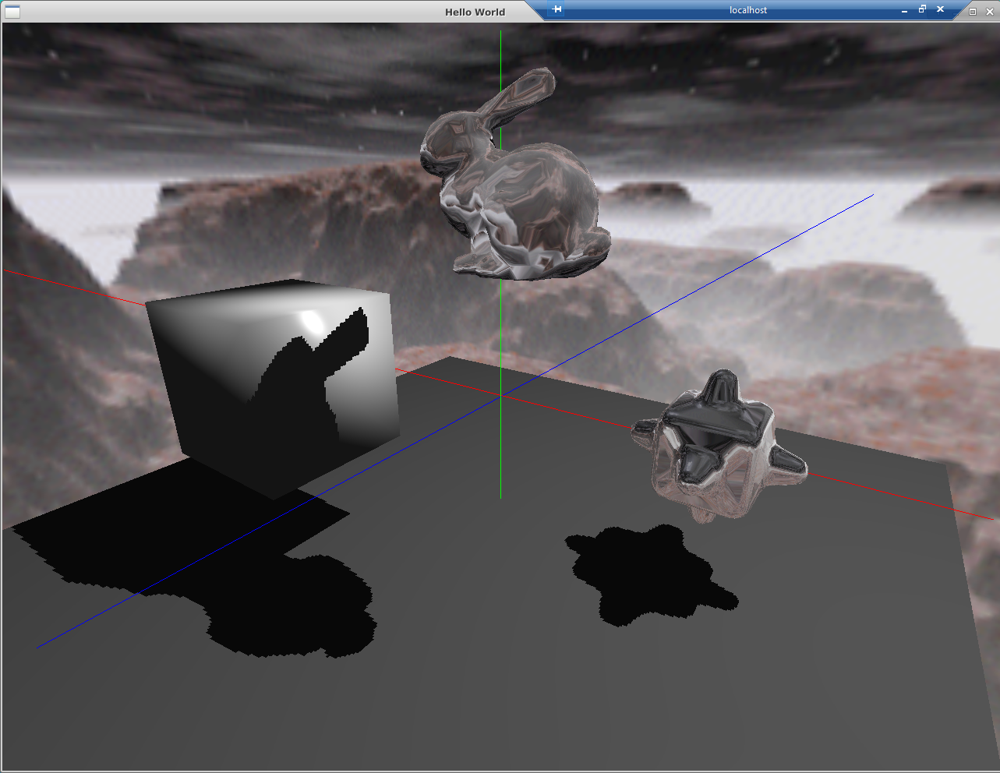

# Assignment-4 Environment Mapping and Shadow Mapping
Author : Yichen Xie\
Date: Nov/30/2021

## Assignment Tasks
For the introduction to assignment tasks, see
[Assignment-4 Environment Mapping and Shadow Mapping](https://github.com/nyu-cs-cy-6533-fall-2021/base/blob/main/Assignment_4/requirements/Assignment4.md)


## Installation
This project is built by CMAKE. Try:
```shell
> cd build
> cmake ..
> make
```

## Result Generation
You can generate experiment results by running bin file in the project folder:
```shell
{PROJECT_DIR}/build/Assignment4_bin
```

## Instructions

### Add Objects
* The key 1 will add a unit cube in the origin
* The key 2 will import a new copy of "bumpy_cube.off"
* The key 3 will import a new copy of "bunny.off" 

### Object Control
Clicking on a object will select the object, turning its color to bright yellow.

You can transform the object in multiple ways:

#### Rotation
Press key 'r' will activate the rotation mode. Then use 'w' and 's' to rotate along x axis, 'a' and 'd' along y axis, and 'f' and 'g' along z axis.

#### Translation
Press key 't' will activate the translation mode.Then use 'w' and 's' to translate along x axis, 'a' and 'd' along y axis, and 'f' and 'g' along z axis.

#### Scaling
Using 'q' and 'e' to rescale the object, make it bigger or smaller.

#### Delete
Using 'delete' to delete the selected object.

### Camara Control
Press key 'n' to activate the normal mode.

You can change the camara position at any time. Use key 'Up' and 'Down' to move camera along y axis, 'Left' and 'Right' to move along x axis, '-' and '+' to move along z axis.

You can press the key 'm' to activate the trackball mode.

Use key 'Up' and 'Down' to move camera vertically, 'Left' and 'Right' to move horizontally, '-' and '+' to zoom in and out.

### Rendering Mode
By pressing 'z' or 'x' or 'c', you can change the rendering mode of selected object into 'Phong mode' or 'Reflection mode' or 'Refraction mode'.

The picture below shows a cube in phong mode, a bunny in refraction mode and a bumpy cube in reflection mode.


### Shadow Color
Pressing 'b' to change the shadow color between RED and BLACK.

